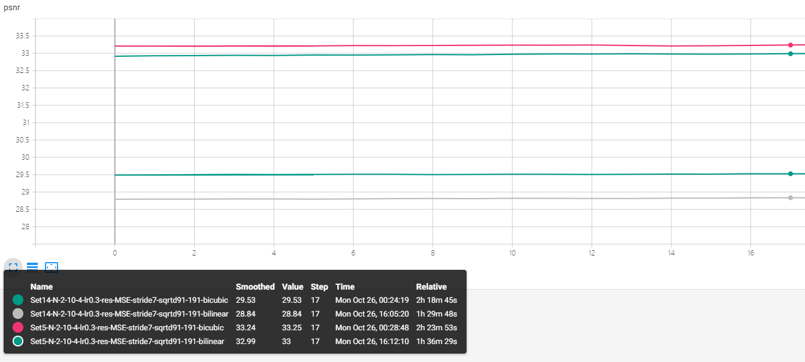

# FSRCNN-实验

[TOC]

## 1 Residual vs no-residual

### Table1-1 : no_residual

| Name                  | FSRCNN-N-56-12-4-SGD-sqrtd91                            |
| --------------------- | ------------------------------------------------------------ |
| Motivation           | 用MSRA(sqrt(2/filter numbers/filter size/filter size)，其中filter number为滤波器数量，filter size为kernel大小)方法初始化权重，在91-image上训练，将结果作为baseline. |
| Patch-size            | Input:7\*7      output: 21\*21                               |
| Learning rate         | 0.5                                                |
| Data-processing       | T91 augment and bicubic downsampling                         |
| Network/task          | N-56-12-4 Super resolution                                   |
| Scale                 | x3                                                           |
| Loss                  | MSE                                                          |
| PSNR(dB)-Set5         | 33.48dB(paper 33.06dB) |
| PSNR(dB)-Set14 | 29.70dB(paper 29.37) |
| Filters: first layers |  |
| Filters: last layers  |  |
| Bicubic               | PSNR24.05dB |
| N-56-12-4-sqrt91      | PSNR 29.01dB |
| Iteration             | 2*10^7 |
| 结论                  | 从psnr和视觉效果查看，通过网络模型学习的映射结果，均明显优于bicubic |

### Table1-2 : residual-MSRA-91

| Name                                       | FSRCNN-N-56-12-4-SGD-sqrtd91-res                             |
| ------------------------------------------ | ------------------------------------------------------------ |
| Motivation                                 | 用MSRA(sqrt(2/filter numbers/filter size/filter size)，其中filter number为滤波器数量，filter size为kernel大小)方法初始化权重，在91-image上训练，将hr-bicubic结果作为label训练残差 |
| Patch-size                                 | Input:7\*7      output: 21\*21                               |
| Learning rate                              | 0.5                                                          |
| Data-processing                            | T91 augment and bicubic downsampling                         |
| Network/task                               | N-56-12-4 Super resolution                                   |
| Scale                                      | x3                                                           |
| Loss                                       | MSE                                                          |
| PSNR(dB)-Set5                              | 33.55dB                                                      |
| PSNR(dB)-Set14                             | 29.66dB                                                      |
| Filters: first layers                      |  |
| Filters: last layers                       |  |
| N-56-12-4-sqrt91                           | PSNR:29.01dB |
| N-56-12-4-sqrt91-res                       | PSNR:29.17dB |
| Iteration                                  | 2*10^7                                                       |
| Convergence Curve- no_residual vs residual |  |
| Conclusion                                 | 在一定的训练次数下，从训练曲线来看，有残差的结构训练更稳定，而且结果略高于无残差的结果，从验证集来看，使用残差的训练，PSNR也略高于无残差的训练，在0.05dB-0.1dB之间 |

## 2 MSRA-Xavier
### Table2-Xavier
| Name                        | FSRCNN-N-56-12-4-SGD-sqrtd91-res                             |
| --------------------------- | ------------------------------------------------------------ |
| Motivation                  | 用Xavier方法初始化权重，在91-image-residual上训练，将结果与MSRA-N56-12-4-sqrtd91-residual对比，看不同初始化的效果 |
| Patch-size                  | Input:7\*7      output: 21\*21                               |
| Learning rate               | 0.5                                                          |
| Data-processing             | T91 augment and bicubic downsampling                         |
| Network/task                | N-56-12-4 Super resolution                                   |
| Scale                       | x3                                                           |
| Loss                        | MSE                                                          |
| PSNR(dB)-Set5               | 33.53dB                                                      |
| PSNR(dB)-Set14              | 29.70dB                                                      |
| Filters: first layers       |  |
| Filters: last layers        |  |
| N-56-12-4-sqrt91-res-MSRA   | PSNR:29.17dB |
| N-56-12-4-sqrt91-res-Vavier | PSNR:29.00dB |
| Iteration                   | 2*10^7                                                       |
| Convergence curve           |  |
| Conclusion                  | 基于MSRA和Xavier的初始化，在Set5和Set14测试集上训练，从训练曲线来看，两种初始化方法，对结果的影响很小，基本一致。但是在验证集上面，Xavier的psnr比MSRA初始化的结果略低，0.1dB |

## 3 DataSize 91VS191
### Table3-191
| Name                        | FSRCNN-N-56-12-4-SGD-sqrtd191-res                            |
| --------------------------- | ------------------------------------------------------------ |
| Motivation                  | 用MSRA方法初始化权重，在191-image-residual上训练，将结果与N56-12-4-sqrtd91res对比，看datasize对结果的影响 |
| Patch-size                  | Input:7\*7      output: 21\*21                               |
| Learning rate               | 0.5                                                          |
| Data-processing             | T91 augment and bicubic downsampling                         |
| Network/task                | N-56-12-4 Super resolution                                   |
| Scale                       | x3                                                           |
| Loss                        | MSE                                                          |
| PSNR(dB)-Set5               | 33.71dB                                                      |
| PSNR(dB)-Set14              | 29.79dB                                                      |
| Filters: first layers       |  |
| Filters: last layers        |  |
| N-56-12-4-sqrt91-res        | PSNR:29.17dB |
| N-56-12-4-sqrt191-res       | PSNR:29.12dB |
| Iteration                   | 2*10^7                                                       |
| Convergence Curve-91 vs 191 |  |
| Conclusion                  | 对于训练，相同的迭代次数下，无论在测试集Set5，还是Set14上，191的数据集，PSNR优于91的训练集。在验证集上，二者表现相似，91的结果反而略高0.05dB |
## 4 MSE vs CLOSS vs HuberLoss
| Structure  |       | N2-10-4-res-closs |        |       | N2-10-4-res-huber |       |
| ---------- | ----- | ----------------- | ------ | ----- | ----------------- | ----- |
| Delta      | 0.01  | 0.001             | 0.0001 | 0.6   | 0.8               | 0.9   |
| Test  Set5 | 33.36 | 33.40             | 33.38  | 33.17 | 33.20             | 33.28 |
| Test Set14 | 29.60 | 29.62             | 29.58  | 29.47 | 29.54             | 29.52 |

| Loss                  | Convergence curve                                            |
| --------------------- | ------------------------------------------------------------ |
| HuberLoss             |  |
| Conclusion1           | 1 HuberLoss  从训练的曲线和最高psnr值来看，无论在Set5还是set14上，0.9是最佳的delta参数 |
| CLoss                 |  |
| Conclusion2           | 2 Closs 从训练的曲线来看,不同的参数0.01，0.001，0.0001，对psnr的影响甚小，尤其是在Set14上体现的更明显。但从最高的PSNR来评估，0.001是最佳参数值 |
| MSE vs HLoss vs Closs |  |
| Conclusion3           | 2 从训练曲线观察到，在其他所有条件相同，只有损失函数不同的情况下，无论在Set14还是Set5的情况下，Closs都是最好的损失函数。 |
## 5 Parameter number
| Net(x3)    | N2-6-2                                                       | N2-8-3                                                       | N2-10-4                                                      | N2-14-4                                                      |
| ---------- | ------------------------------------------------------------ | ------------------------------------------------------------ | ------------------------------------------------------------ | ------------------------------------------------------------ |
| Structure  | 6(3)-6(3)x2-dc(7)                                            | 8(3)-8(3)x3-dc(7)                                            | 10(3)-10(3)x4-dc(7)                                          | 14(3)-14(3)x4-dc(7)                                          |
| Base_lr    | 0.5                                                          | 0.5                                                          | 0.5                                                          | 0.5                                                          |
| Test set5  | 32.64                                                        | 32.96                                                        | 33.19                                                        | 33.28                                                        |
| Test set14 | 29.12                                                        | 29.35                                                        | 29.47                                                        | 29.57                                                        |
| Result     | PSNR 27.26dB | PSNR 27.91dB | PSNR 28.30dB | PSNR 28.41dB |

|             | Convence curve                                               |
| ----------- | ------------------------------------------------------------ |
| 1k,2k.4k,8k |  |
| Conclusion  | 在其他所有条件相同，只有网络参数不同的情况下，无论在Set5还是Set14，在以上网络参数情况下，参数数量越多，psnr的值越高，训练效果越佳。 |
## 6 base91 Bicubic vs Bilinear
### Table6-1 : finetune-191-bicubic
先在91-images（bicubic）训练，再在191-images（bicubic）finetune

| Net(x3)     | N2-6-2                                                       | N2-8-3                                                       | N2-10-4                                                      | N2-14-4                                                      |
| ----------- | ------------------------------------------------------------ | ------------------------------------------------------------ | ------------------------------------------------------------ | ------------------------------------------------------------ |
| Structure   | 6(3)-6(3)x2-dc(7)                                            | 8(3)-8(3)x3-dc(7)                                            | 10(3)-10(3)x4-dc(7)                                          | 14(3)-14(3)x4-dc(7)                                          |
| Base_lr     | 0.3                                                          | 0.3                                                          | 0.3                                                          | 0.3                                                          |
| Test set5   | 32.69(32.64)                                                 | 33.02(32.96)                                                 | 33.26(33.19)                                                 | 33.36(33.28)                                                 |
| Test set14  | 29.20(29.12)                                                 | 29.40(29.35)                                                 | 29.54(29.47)                                                 | 29.64(29.57)                                                 |
| Result      | PSNR 27.31dB | PSNR 28.01dB | PSNR 28.23dB | PSNR 28.58dB |
| Conculusion |                                                              | 对比table5，基于91预训练的模型，在191-bicubic上微调的结果略优于预训练模型0.1dB左右。验证集的结果也优于预训练模型 |                                                              |                                                              |
### Table6-2 : finetune-191-bilinear
先在91-images（bicubic）训练，再在191-images（bilinear）finetune

| Net(x3)    | N2-6-2                                                       | N2-8-3                                                       | N2-10-4                                                      | N2-14-4                                                      |
| ---------- | ------------------------------------------------------------ | ------------------------------------------------------------ | ------------------------------------------------------------ | ------------------------------------------------------------ |
| Structure  | 6(3)-6(3)x2-dc(7)                                            | 8(3)-8(3)x3-dc(7)                                            | 10(3)-10(3)x4-dc(7)                                          | 14(3)-14(3)x4-dc(7)                                          |
| Base_lr    | 0.3                                                          | 0.3                                                          | 0.3                                                          | 0.3                                                          |
| Test set5  | 32.52(32.64)                                                 | 32.76(32.96)                                                 | 33.00(33.19)                                                 | 33.07(33.28)                                                 |
| Test set14 | 28.52(29.12)                                                 | 28.70(29.35)                                                 | 28.85(29.47)                                                 | 28.94(29.57)                                                 |
| Result     | PSNR 24.70dB | PSNR 25.08dB | PSNR 25.35dB | PSNR 25.58dB |
| Conclusion |                                                              | 对比table5最佳的psnr，基于91的预训练模型，其他条件不变，在191-bilinear的微调下，结果差于预训练模型0.5dB-1dB之间，而且验证集的结果更差，还出现了黑影。 |                                                              |                                                              |
### Table6-4 Convergence curve 191-bicubic vs 191-bilinear
| bicubic vs bilinear | Convergence curve                                            |
| ------------------- | ------------------------------------------------------------ |
| N2-6-2(1K)          |  |
| N2-8-3(2K)          |  |
| N2-10-4(4K)         |  |
| N2-14-4(8K)         |  |
| Conclusion          | 从以上训练曲线看出，无论是参数数量是1k,2K,4K,8K,基于91预训练模型上，191-bicubic的结果均优于191-bilinear的结果，验证结果在Table6-1,Table6-2对比过，同样191-bicubic的结果均优于191-bilinear的结果。 |

## 7 x2 vs x4

对Table5中参数量为4k结构为N2-10-4的模型，将deconv层的stride改为2（x2）和4（x4）并修改相应的padding，在相应的数据集上进行finetune。

| Scale           | x2                                                           | x4                                                           |
| --------------- | ------------------------------------------------------------ | ------------------------------------------------------------ |
| Base_lr         | 0.3                                                          | 0.3                                                          |
| ConvTranspose2d | (kernel_size=7, stride=2, padding=3, output_padding=1)       | (kernel_size=7, stride=4, padding=2, output_padding=1)       |
| Set5            | 36.86                                                        | 30.68                                                        |
| Set14           | 32.09                                                        | 27.03                                                        |
| Result          | PSNR 32.51dB | PSNR 23.26dB |
| Residual        |  |  |
| Conclusion      | 在x3的基础上面微调最后一层，得到x2的结果，单从PSNR来看，有了很大提升，但是还是不及论文中直接通过lr-hr训练的效果好。 | 微调最后一层，得到x4的结果，对比x2的residual纹理，我们可以看到，psnr值越高，效果越好的图片，纹理越精细，越清晰。 |

|                   |                                                              |
| ----------------- | ------------------------------------------------------------ |
| Convergence curve |  |
| Conclusion        | 在只微调最后一层的情况下，从训练曲线来看，psnr的值起伏在0.1dB之内，损失值变化也很小。对于训练效果的提升作用比较微小。而且能明显的看出，无论在Set5还是Set14上，在x2的结果都远远优于x4的结果。 |

